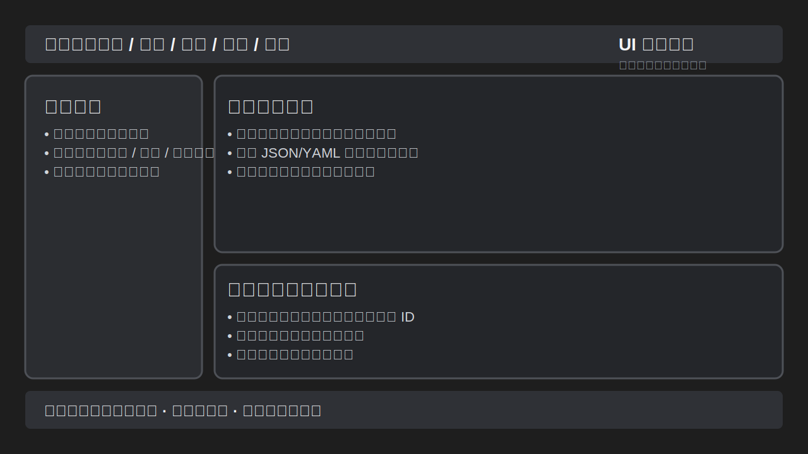

[English](./user_manual.md) | [简体中文](./user_manual.zh-CN.md)

---

# T4T Task Management Platform - User Manual (v1.0)

## 1. Welcome to T4T

Welcome to T4T v1.0, a powerful and flexible automation tool. Whether you want to execute repetitive tasks on a schedule or build complex event-driven workflows, T4T has you covered. This manual will guide you through the software's features.

## 2. Main Interface Overview

The main window is organized into clear zones: the left task list for browsing jobs, the right detail tabs for configuration and monitoring, the top toolbar with quick actions, and the bottom status bar showing system health and message bus connectivity.

*   **Task List (Left Panel)**: Centrally displays all your tasks. The status of each task (Running, Paused, Listening, or Stopped) is visible at a glance.
*   **Detail Area (Right Panel)**: A tabbed area for configuring new tasks, modifying existing ones, viewing real-time logs, and adjusting application settings.
*   **Toolbar (Top)**: Provides shortcuts for common actions like "Add Task," "Start All," "Pause All," etc.
*   **Status Bar (Bottom)**: Shows a system summary, including the total number of tasks, CPU/memory usage, and the crucial **Message Bus connection status**.

---

## 3. Core Features Explained

### 3.1. Managing Your Tasks

*   **Add New Task**: Click the `+` (Add) icon on the toolbar to open the "New Task" configuration page on the right.
*   **Control Tasks**: Select one or more tasks and use the "Start," "Pause," and "Stop" buttons on the toolbar to control their lifecycle.
*   **Delete Task**: Right-click a task in the list and select "Delete."

### 3.2. Understanding Task Triggers

When creating or editing a task, the "Trigger Type" is the most critical setting. It determines *when* the task will be executed.

| Trigger Type | Use Case Description |
| :--- | :--- |
| `schedule` | **Scheduled Execution**: For tasks that need to run on a fixed schedule. For example: every 5 minutes, every weekday at 9 AM, or at 3 PM on January 1, 2025. |
| `event` | **Event-Driven**: For tasks that respond to specific events occurring in the system. The task "listens" to a message topic and only executes when a message arrives on that topic. |

### 3.3. Configuring a Task

On the "New Task" or "Edit Task" page, you will see the following key configuration areas:

*   **Basic Information**: Set the task's name and description.
*   **Trigger Configuration**: This section displays different options based on the trigger type you select.
    *   If you choose `schedule`, you will need to configure parameters like `cron`, `interval`, or `date`.
    *   If you choose `event`, you will need to specify the `topic` the task should subscribe to.
*   **Input Parameters (`inputs`)**: This defines the parameters the task needs to run. For event-driven tasks, these parameters typically come from the content of the event it is listening to.

### 3.4. Real-Time Monitoring

*   **Task Logs (`Output` Tab)**: The output of each task (including info, warnings, and errors) is displayed here in real-time. This is the most important window for debugging and monitoring task execution.
*   **Task State (`State` Tab)**: Shows the detailed status of a task, for example:
    *   For scheduled tasks, it will show the "Next Run Time."
    *   For event tasks, it will show the "Topic" it is listening to and its current status (e.g., "Listening").

---

## 4. Event-Driven Architecture and the Message Bus

The core of T4T v1.0 is the **Message Bus** (usually an MQTT server), which allows tasks to communicate with each other and with the outside world.

*   **How It Works**: Imagine a post office system. A task (the publisher) can send a letter (a message) to a specific address (a topic). Any other task or tasks (the subscribers) interested in this address can "subscribe" to it and will receive the letter instantly upon its arrival.
*   **Connection Status**: Be sure to pay attention to the status bar in the bottom-right corner of the main interface. A dedicated icon will show whether the application is currently connected to the message bus. **If the connection is lost, all event-driven tasks will be unable to receive events.**

## 5. Application Settings

Click the "Settings" icon (usually a gear) on the main toolbar to open the global settings page.

*   **Theme & Language**: Personalize your application's appearance and display language here.
*   **Message Bus Configuration**: This is where you configure how T4T connects to your MQTT server. You need to correctly fill in the server address, port, username, and password (if required).

## 6. Frequently Asked Questions (FAQ)

*   **Q: My scheduled task isn't running on time.**
    *   **A:** Please check: 1) Is the task in the "Started" state? 2) In the "State" tab, is the "Next Run Time" correct? 3) Check the main application log or the task's own log for any error messages.

*   **Q: My event-driven task is not responding.**
    *   **A:** Please check: 1) Is the task in the "Listening" state? 2) Does the message bus icon in the status bar show as "Connected"? 3) Confirm that the source publishing the message (another task or an external program) is actually publishing to the exact same topic that the task is listening to.

*   **Q: How can I make two tasks work together?**
    *   **A:** This is the beauty of event-driven design! Have Task A, upon completion, publish a message with its result to a topic (e.g., `tasks/A/result`). Then, create an event-driven Task B and have it subscribe to the `tasks/A/result` topic. This way, whenever A finishes, B will be automatically triggered and receive A's results.

---

## 7. Installation & Deployment

### 7.1. System Requirements

* **Operating System**: Windows 10/11, macOS 12+, or modern Linux distributions with a graphical environment.
* **Python Runtime**: Python 3.10 or newer (matches the PyQt5 toolchain used by the project).
* **Message Bus**: An accessible MQTT broker (e.g., Mosquitto). If you enable the embedded broker in `config/config.ini`, ensure no other process occupies the configured port.

### 7.2. Installation Steps

1. **Create Environment**
   ```bash
   python -m venv .venv
   source .venv/bin/activate  # Windows: .venv\Scripts\activate
   ```
2. **Install Dependencies**
   ```bash
   pip install -r requirements.txt
   ```
3. **Configure Message Bus**
   * Edit `config/config.ini` → `[MessageBus]` section, set `host`, `port`, credentials, and `keepalive`.
   * For embedded broker mode, set `embedded_broker.enabled = true`, ensure the port is free, and confirm the `services.embedded_mqtt_broker` logs show no errors.
4. **Launch Application**
   ```bash
   python main.py
   ```
5. **Optional Packaging**: Refer to the README “Packaging & Runtime Requirements” section for PyInstaller steps when distributing to end users.
6. **Post-install Checklist**:
   * Confirm the message bus icon in the UI status bar is green and displays “Connected”.
   * Create a `schedule` task and run it manually to validate the thread pool and log output.
   * If multilingual UI or theme switching is enabled, toggle them once to verify resources load correctly.

### 7.3. Deployment Checklist

* Verify the `tasks/` directory contains only intended task instances before packaging.
* Confirm the `logs/` directory has write permissions on the target host.
* Test at least one scheduled task and one event-driven task end-to-end after deployment.

### 7.4. License & Notices

* Include the repository’s [LICENSE](../LICENSE) file with every installer or archive—PyInstaller builds should already copy it when the README command is followed.
* Review [docs/licenses.md](./licenses.md) for the up-to-date dependency inventory and document the chosen compliance posture for PyQt5 (GPL source release or commercial entitlement).

---

## 8. Common Errors & Troubleshooting

### 8.1. Message Bus Disconnected

* **Symptom**: Status bar icon turns gray or displays “Disconnected”, event tasks remain in `Listening` but never trigger.
* **Quick Checks**:
  1. Open the **Settings → Message Bus** page, confirm host/port/user credentials.
  2. Inspect `logs/t4t.log` for `MQTT connection failed` entries (search for `MessageBusManager`).
  3. If using the embedded broker, ensure the `ServiceManager` reports `RUNNING` in the application log before connection attempts.
* **Recovery**:
  * Click the reconnect button in the status bar or restart the application after confirming the broker is reachable.
  * For persistent failures, temporarily disable event-driven tasks or switch to an external broker for verification.
  * If the issue repeats, increase `reconnect_interval` in `config/config.ini` and monitor the backoff timing in the logs.

### 8.2. Scheduler Not Triggering

* **Symptom**: Scheduled task shows a stale “Next Run Time”.
* **Quick Checks**:
  1. Confirm the task is in `Started` state; paused tasks do not reschedule.
  2. Review the task’s configuration tab — verify cron/interval fields.
  3. Check system time synchronization; APScheduler relies on local clock accuracy.
* **Recovery**:
  * Toggle the task off and on to force APScheduler to rebuild the job.
  * Restart the application to clear misconfigured jobs if cron expressions were corrected.
  * If the task depends on external module assets, verify that the configuration under `tasks/<task_id>/` has been reloaded after updates.

### 8.3. UI Not Responding During Task Execution

* Ensure heavy computations are offloaded to worker threads (default behavior). If a custom module performs blocking I/O on the UI thread, refactor logic into the `run` function and use the provided context logger instead of modal dialogs.

---

## 9. UI Walkthrough Example



1. **Toolbar actions**: Use the top toolbar to create tasks, start/pause in bulk, or open settings. After editing configurations, click “Save” to persist changes immediately.
2. **Task list**: The left pane supports status filtering and multi-selection. Right-click to clone, delete, or export task configurations quickly.
3. **Task detail tabs**: Tabs such as “Configuration,” “State,” and “Logs” on the right reveal triggers, input parameters, and recent execution records.
4. **Real-time log panel**: The bottom log pane streams contextual logs, exception traces, and scheduler events in real time, with keyword filtering and export capabilities.
5. **Status bar indicators**: The bottom status bar shows message bus connectivity, thread pool usage, and theme/language information. Yellow warning icons can be clicked for detailed error messages.
